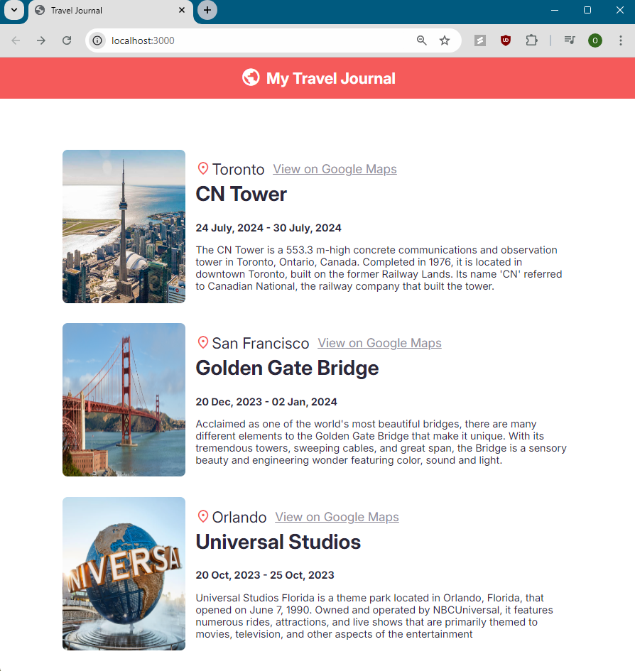

# React Travel Journal App

- Use of seperate file with data to practice handling and transforming data in react.
- Use of props to pass data from one component to another and promote reusable components.
- Hone skills in JSX and CSS styling using the react framework. 

